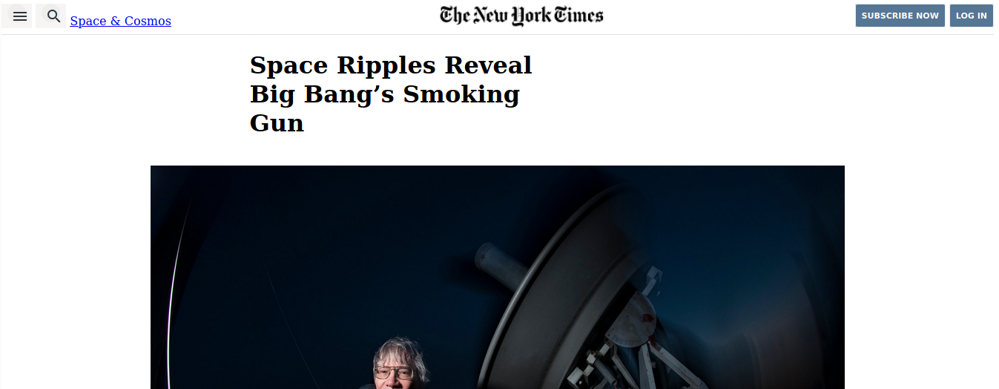

# New York Times clone page

>  This page represents the usage of grid, flex and float elements. Also positioning properties for css and selection tagging.  

Additional description about the project and its features.

## Built With

- HTML,
- CSS,

## Getting Started

Simply download the zip and decompress. Once decompressed, double click or open index.html in any web browser. 

To get a local copy up and running follow these simple example steps.

### Prerequisites

Any web browser will do, Mozilla, Safari, or Chrome. 

### Setup

None needed drecompress and drag and drop onto browser. 

### Install

None needed. 

### Usage

Microverse Curriculum. 

### Run tests

Text editor and web browser.

### Deployment

Localhost. 

## Authors

👤 **Juan Pulo Perez Tejada**

- Github: [@Maclenn77](https://github.com/Maclenn77)
- Twitter: [@srjuanpapas](https://twitter.com/srjuanpapas)
- Linkedin: [linkedin](https://mx.linkedin.com/in/juanpaulopereztejada )

👤 **Miguel Angel Enciso Sanchez**

- Github: [@rootDEV2990](https://github.com/rootDEV2990)
- Twitter: [@m29902](https://twitter.com/m29902)
- Linkedin: [linkedin](https://www.linkedin.com/in/miguel-enciso-6474741a1/)

## 🤝 Contributing

Contributions, issues and feature requests are welcome!

Feel free to check the [issues page](issues/).

## Show your support

Give a ⭐️ if you like this project!
 
## 📝 License

This project is for microverse course purposes.